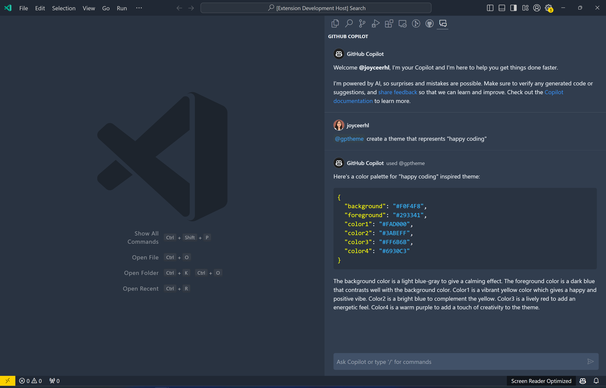

# GPTheme

Generate custom themes for VS Code from natural language!

1. Install this extension
2. Sign up for GitHub Copilot
3. Open the GitHub Copilot chat view
4. Type `@gptheme` followed by a description of the theme you want to generate

